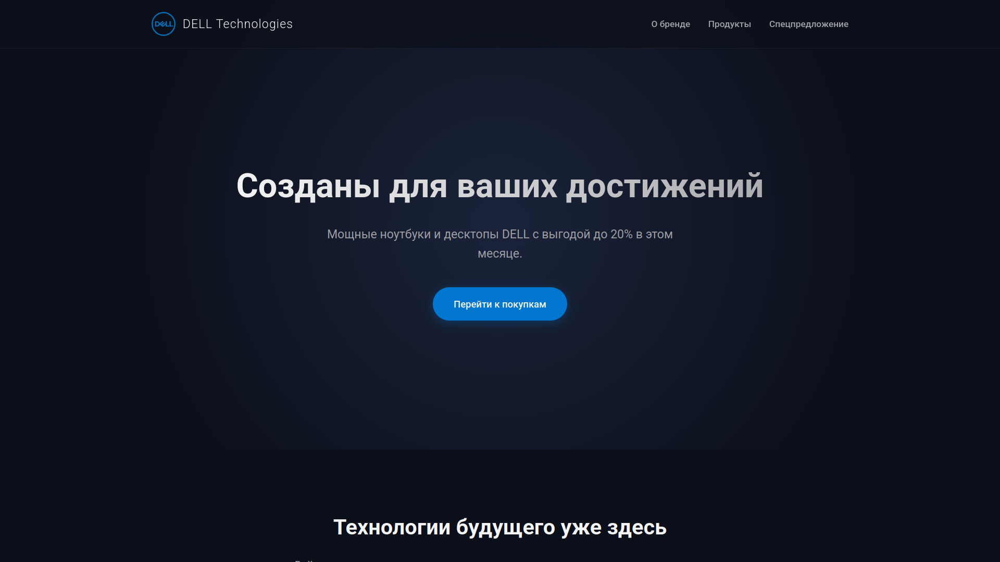
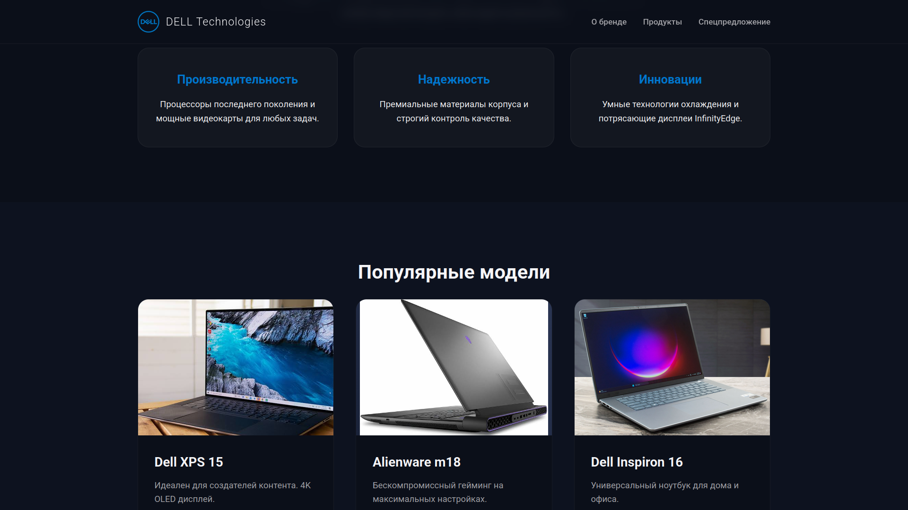
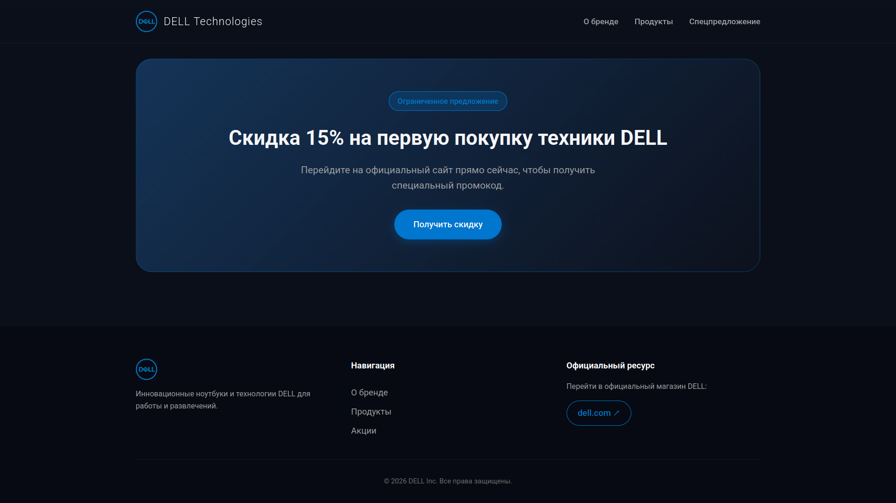
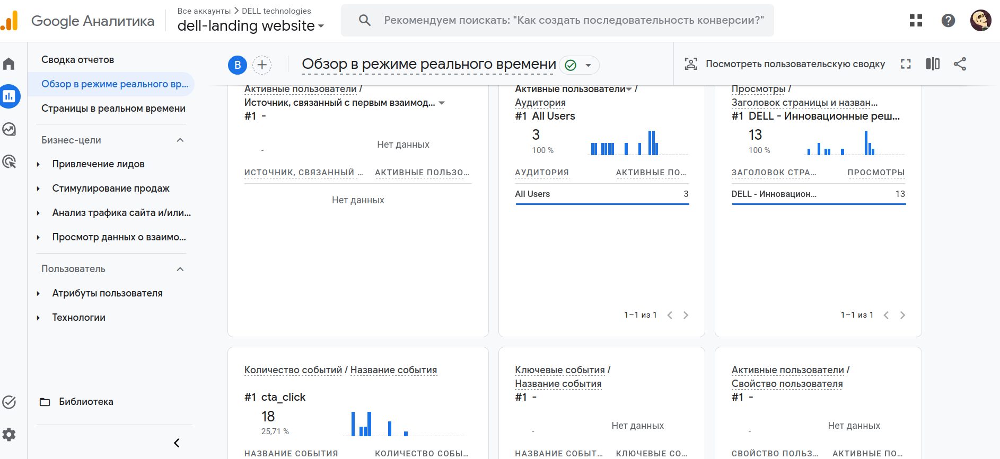
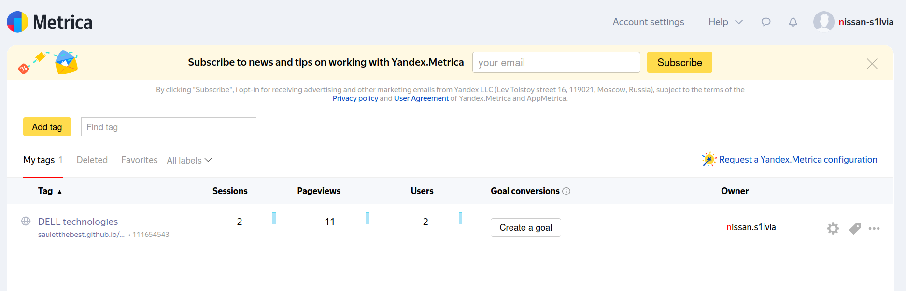

## 💻 DELL Technologies - Commercial Promo Landing Page

> Современный, адаптивный промо-лендинг для бренда **DELL** со сквозной интеграцией аналитических систем (**Google Analytics 4**, **Google Tag Manager**, **Яндекс.Метрика с Вебвизором**) и отслеживанием целевых действий пользователей (CTA).


---

## 🌐 Живая демо-версия (Live Demo)

🔗 **[Открыть проект на GitHub Pages](https://sauletthebest.github.io/DELL-landing-page/)**

---

## 📸 Скриншоты интерфейса

<div align="center">
  
  <p><i>Главный экран лендинга с брендингом DELL и первичной CTA-кнопкой</i></p>
  
  <br />
  
  
  <p><i>Блок преимуществ и карточки популярных ноутбуков (XPS 15, Alienware, Inspiron)</i></p>
  
  <br />
  
  
  <p><i>Секция спецпредложения и подвал с официальными ссылками</i></p>
</div>

---

## ✨ Ключевые особенности проекта

- 🎨 **Премиальный Dark Mode дизайн:** Выполнен в корпоративных цветах DELL (`#0076CE`) с применением эффектов Glassmorphism и плавными микроанимациями.
- 📱 **100% Адаптивность:** Корректное отображение на всех типах устройств (смартфоны, планшеты, десктопы).
- ⚡ **Высокая скорость загрузки:** Чистый HTML5 / CSS3 / Vanilla JS без сторонних тяжёлых библиотек и фреймворков.
- 🎯 **Оптимизированные CTA-переходы:** Все кнопки призыва к действию ведут на соответствующие разделы официального магазина DELL (`target="_blank"` с бесбойной передачей контекста).

---

## 📊 Интеграция Аналитики и Трекинга

В проект внедрена коммерческая система веб-аналитики через **Data Layer** и **Google Tag Manager**:

```text
Пользователь кликает CTA ──> JS (dataLayer.push) ──> GTM (Триггер cta_button_click) ──> GA4 & Yandex.Metrika
```

### 1. Google Tag Manager (GTM)
- Идентификатор контейнера: `GTM-5C3QFNFN`
- Управляет скриптами аналитики без вмешательства в исходный код сайта.

### 2. Google Analytics 4 (GA4)
- Идентификатор тега: `G-CY33GEF1MK`
- Фиксирует базовые просмотры страниц (`page_view`), сессии, глубину прокрутки (`scroll`) и кастомные конверсионные клики (`cta_click`).

### 3. Яндекс.Метрика с Вебвизором
- Номер счётчика: `111654543`
- Настроен **Вебвизор** (запись видеосессий пользователей), карты кликов и скроллинга для анализа поведения аудитории.

---

### 📈 Подтверждение сбора данных (Analytics Proof)

<div align="center">
  
  <p><i>Google Analytics 4: Отслеживание кастомных событий cta_click в реальном времени</i></p>
  
  <br />
  
  
  <p><i>Яндекс.Метрика: Подключенный счетчик и зафиксированные визиты</i></p>
</div>

---

## 🛠 Технологический стек

- **Frontend:** HTML5, CSS3 (Variables, Flexbox, Grid), Vanilla JavaScript (ES6+)
- **Analytics & Tracking:** GTM, GA4, Yandex.Metrika, DataLayer API
- **Assets:** SVG & PNG иконки бренда DELL
- **Hosting & CI/CD:** GitHub Pages

---

## 📁 Структура проекта

```text
dell-landing/
├── css/
│   └── style.css       # Основные стили, переменные, темная тема и медиазапросы
├── js/
│   └── main.js         # Обработка событий и передача кликов в dataLayer
├── images/             # Иконки бренда и фото ноутбуков
├── screenshots/        # Скриншоты интерфейса и дашбордов аналитики
├── index.html          # Главная страница с тегами GTM и разметкой
└── README.md           # Документация проекта
```

---

## 🚀 Локальный запуск

1. Клонируйте репозиторий:
   ```bash
   git clone https://github.com/SauletTheBest/dell-landing.git
   ```
2. Откройте файл `index.html` в любом современном браузере.

---
